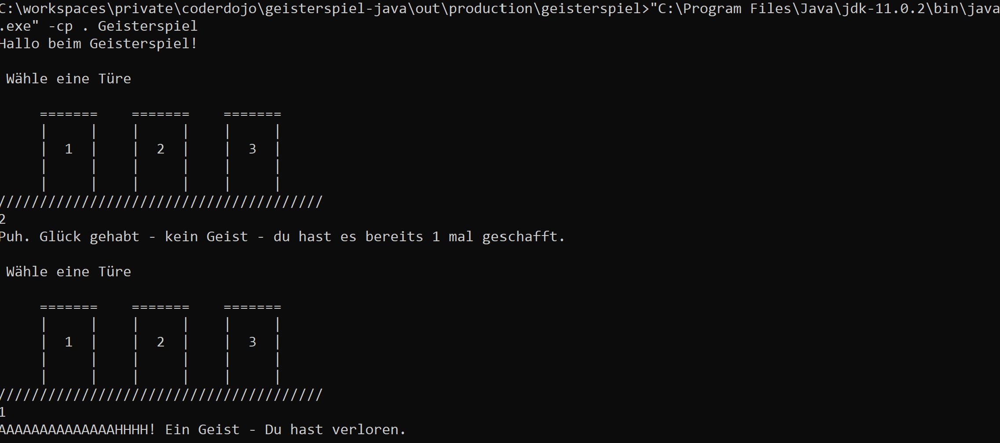

# Erste Schritte in Java - Geisterspiel
In diesem Beispiel geht es darum in der Programmiersprache Java ein kleines Spiel zu programmieren.
Das gleiche Spiel gibt es auch in den Programmiersprachen [Python](../python/python-geisterspiel.html) und [C#](../csharp/geisterspiel.html).



Du kannst das Spiel entweder lokal in einer IDE (z.B. [IntelliJ](https://www.jetbrains.com/idea/download)) oder ganz einfach direkt im Browser auf [CheerpJ](https://javafiddle.leaningtech.com/) ausprobieren.

## Die Aufgabe
Du kannst pro Runde eine von 3 Türen wählen die du öffnest. Hinter einer der Türen versteckt sich allerdings ein Geist. Erwischt dich der Geist ist das Spiel zu Ende, sonst kommst du in die nächste Runde.

## Ein einfaches Java-Konsole-Programm
Anwendunge in Java werden über die Sogenannte `Main Class` gestartet. Das ist eine Klasse die folgende Voraussetzunge erfüllt:
* Sie ist öffentlich sichtbar, also `public`
* Sie besitzt eine öffentliche statische `Methode` mit dem Namen `main` und bekommt als Parameter die einzelnen Teile von der Kommandozeile mit

```java
public class Geisterspiel {

    public static void main(String []args) {
        // hier würde das Programm stehen
    }
}
```

## Ein und Ausgabe in Java
Ausgaben in Java können relativ einfach über `System.out.println("Hallo Welt");` gemacht werden. Beim einlesen von Daten ist die Sache etwas komplizierter. Um Zeilenweise lesen zu können bedient man sich z.B. des *Scanners* `java.util.Scanner`. Ist dieser mit `new Scanner(System.in)` initialisiert, kann man damit Zeilen (`scanner.read()`) oder auch Zahlen (`scanner.readInt()`) lesen.

Für unser Geisterspiel müssen wir auch überprüfen, ob die Eingabe auch richtig ist (ein Zahl zwischen 1 und 3).

```java

	private int versucheTuere(Scanner in) {
		int versuch = 0;
		do { // frage so lange bis eine gültige Eingabe erfolgt ist.
			try {
				versuch = in.nextInt();
			} catch(Exception ex) {
				in.next(); // wenn Quatsch eingegeben wurde, muss er leider auch gelesen werden
			}
			if (versuch < 1 || versuch > 3) {
				System.out.println("Falsche Eingabe - bitte wähle eine Zahl von 1 - 3");
				continue; // fange wieder oben an.
			}

		} while(versuch < 1 || versuch > 3);

		return versuch;
	}

```

## Zufallszahlen
Die Java Bibliothek bringt für Zufallszahlen die Klasse `java.util.Random` mit. Damit der Zufallszahlengenerator jedes mal einen neuen Startwert erhält ist es üblich ihn mit der aktuellen Systemzeit zu initialisieren.

```java
Random zufallsGenerator = new Random(System.currentTimeMillis());
```

## Die Hauptschleife - wiederhole bis zum Ende des Spiels
Wenn du genaueres zu Schleifen in Java wissen möchtest kannst du [diesem Link](http://www.java-programmieren.com/schleifen-java.php) hier folgen.

Da wir zumindest eine Eingabe überprüfen möchten haben wir uns für dieses Beispiel für eine `do ... while`-Schleife entschieden.

```java
    public static void main(String []args) {
        Geisterspiel spiel = new Geisterspiel();
        spiel.spiele();
    }

    private void spiele() {
        zeichneBegruessung();
        boolean geistGefunden = false;
        Random zufallsGenerator = new Random(System.currentTimeMillis());

        Scanner in = new Scanner(System.in);
        int geisterTüre = zufallsGenerator.nextInt(3) + 1; // ermittle Türe hinter der sich ein Geist befindet (1-3)

        do {
            zeichneTueren();
            int versuch = versucheTuere(in);

            if (versuch == geisterTüre) {
                System.out.println("AAAAAAAAAAAAAAHHHH! Ein Geist - Du hast verloren.");
                geistGefunden = true;
            } else {
                System.out.println("Puh. Glück gehabt - kein Geist.");
                geisterTüre = zufallsGenerator.nextInt(3) + 1; // neue GeisterTüre
                geistGefunden = false;
            }
        } while (!geistGefunden);
}
```


## Eine mögliche Lösung

```java
import java.util.Random;
import java.util.Scanner;

public class Geisterspiel {

	public static void main(String []args) {
		Geisterspiel spiel = new Geisterspiel();
		spiel.spiele();
	}

	private void spiele() {
		zeichneBegruessung();
		boolean geistGefunden = false;
		Random zufallsGenerator = new Random(System.currentTimeMillis());

		Scanner in = new Scanner(System.in);
		int geisterTüre = zufallsGenerator.nextInt(3) + 1; // ermittle Türe hinter der sich ein Geist befindet (1-3)

		do {
			zeichneTueren();

			int versuch = versucheTuere(in);

			if (versuch == geisterTüre) {
				System.out.println("AAAAAAAAAAAAAAHHHH! Ein Geist - Du hast verloren.");
				geistGefunden = true;
			} else {
				System.out.println("Puh. Glück gehabt - kein Geist.");
				geisterTüre = zufallsGenerator.nextInt(3) + 1; // neue GeisterTüre
				geistGefunden = false;
			}

		} while (!geistGefunden);
	}

	private void zeichneTueren() {
		System.out.println("");
		System.out.println(" Wähle eine Türe ");
		System.out.println("");
		System.out.println("     =======    =======    =======");
		System.out.println("     |     |    |     |    |     |");
		System.out.println("     |  1  |    |  2  |    |  3  |");
		System.out.println("     |     |    |     |    |     |");
		System.out.println("     |     |    |     |    |     |");
		System.out.println("///////////////////////////////////////");
	}

	private void zeichneBegruessung() {
		System.out.println("Hallo beim Geisterspiel!");
	}

	private int versucheTuere(Scanner in) {
		int versuch = 0;
		do { // frage so lange bis eine gültige Eingabe erfolgt ist.
			try {
				versuch = in.nextInt();
			} catch(Exception ex) {
				in.next(); // wenn Quatsch eingegeben wurde, muss er leider auch gelesen werden
			}
			if (versuch < 1 || versuch > 3) {
				System.out.println("Falsche Eingabe - bitte wähle eine Zahl von 1 - 3");
				continue; // fange wieder oben an.
			}

		} while(versuch < 1 || versuch > 3);

		return versuch;
	}
}
```